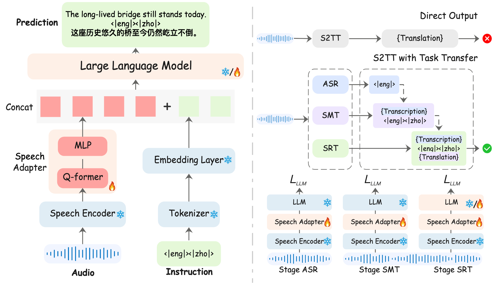
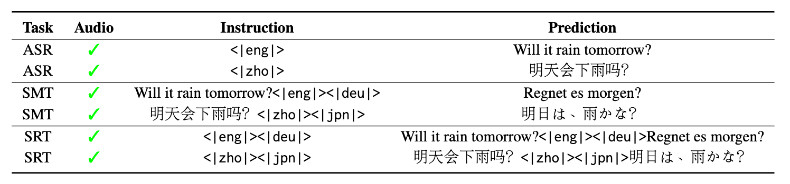

This project is a subproject of https://github.com/X-LANCE/SLAM-LLM.  

# LLM-SRT 
[Paper](https://arxiv.org/abs/2409.19510);

✅ **Current Version (v1.0)**  
- **Supported 15 Languages**: Chinese (zho), English (eng), Japanese (jpn), Korean (kor), German (deu), French (fra), Indonesian (ind), Italian (ita), Dutch (nld), Portuguese (por), Russian (rus), Spanish (spa), Thai (tha), Vietnamese (vie), Cantonese (yue)
- **Full Pairwise** - Supports all 210 possible translation directions (15×14 language pairs)  

🚀 **Coming Soon (v2.0 Beta)**  
• **28 Languages**: Expanding to include Arabic, Hindi, Turkish and 10 more  
• **756 Translation Directions**: New architecture enables 3.6x more language pairs  


## Installation
```
sudo apt-get install python3-setuptools

conda create -n llm-srt python=3.10
conda activate llm-srt

git clone https://github.com/yxduir/LLM-SRT
cd LLM-SRT

pip install -e .
sudo apt install ffmpeg
pip install -r requirements.txt
```

## Download Model 
Encoder | Adapter | LLM 
|---|---|---
[whisper-large-v3](https://huggingface.co/openai/whisper-large-v3) | [q-former+mlp](https://huggingface.co/yxdu/llm-srt) | [Qwen2.5-3B](https://huggingface.co/Qwen/Qwen2.5-3B) 
```
cd models/

git lfs clone https://huggingface.co/yxdu/llm-srt
git lfs clone https://huggingface.co/openai/whisper-large-v3
# for 3B model (support 15 languages)
git lfs clone https://huggingface.co/Qwen/Qwen2.5-3B
```

## Infer Demo
This is an automatic inference script for the fleurs dataset from English (eng) to Chinese (zho).
```
bash examples/st_covost2/scripts/infer_hf.sh
```

## Train Dataset
If you want to train your own model, you can download the following datasets.
```
[Common Voice](https://commonvoice.mozilla.org/en/datasets)

[Fleurs](https://huggingface.co/datasets/google/fleurs)
```


## Data preparation
You need to prepare the data jsonl in this format.  
| audio      | source           | prompt                     | gt            |
|------------|------------------|----------------------------|---------------|
| audio_path | `{dataset}_{src}_{tgt}` | `<\|{src}\|><\|{tgt}\|>`| `transcription{prompt}translation` |
```
{"audio": "eng/test/139.wav", "source": "fleurs_eng_zho", "prompt": "<|eng|><|zho|>", "gt": "They have feet with scales and claws, they lay eggs, and they walk on their two back legs like a T-Rex.<|eng|><|zho|>它们脚上有鳞片和爪子，会产卵，还像霸王龙一样用两条后腿走路。"}
{"audio": "deu/test/0.wav", "source": "fleurs_deu_ara", "prompt": "<|deu|><|ara|>", "gt": "Für die besten Aussichten auf Hongkong sollten Sie die Insel verlassen und zum gegenüberliegenden Ufer von Kowloon fahren.<|deu|><|ara|>لكي تحظى بأفضل المشاهد لهونج كونج، غادر الجزيرة واتجه إلى واجهة كولون البحرية في الجهة المقابلة."}
{"audio": "jpn/test/485.wav", "source": "fleurs_jpn_ita", "prompt": "<|jpn|><|ita|>", "gt": "これらの結晶の組成は、赤外分光法（FTIR）で比較すると、患部のペットの尿中に見られるものと一致します。<|jpn|><|ita|>Al confronto mediante spettroscopia infrarossa (FT-IR), la composizione di questi cristalli corrisponde a quella individuata nell'urina degli animali da compagnia che ne sono colpiti."}
```
## Training and Inference
You can use the following scripts to perform training and inference separately. 
For all.sh, you can modify the training task based on the 'mode' keyword: asr, smt, srt.
```
#train
bash examples/st_covost2/scripts/all.sh


#infer
bash examples/st_covost2/scripts/infer_all.sh
bash examples/st_covost2/scripts/infer_hf.sh
```


## Model Stracture



## Multitask 



##  Citation
You can refer to the paper for more results. 
```
@article{du2025speech2text,  
  title     = {Making LLMs Better Many-to-Many Speech-to-Text Translators with Curriculum Learning},
  author    = {Du, Yexing and Pan, Youcheng and Ma, Ziyang and Yang, Bo and Yang, Yifang and Deng, Keqi and Chen, Xie and Xiang, Yang and Liu, Ming and Qin, Bing},
  booktitle = {Proceedings of the 63rd Annual Meeting of the Association for Computational Linguistics (ACL 2025)},
  year      = {2025},
}
```